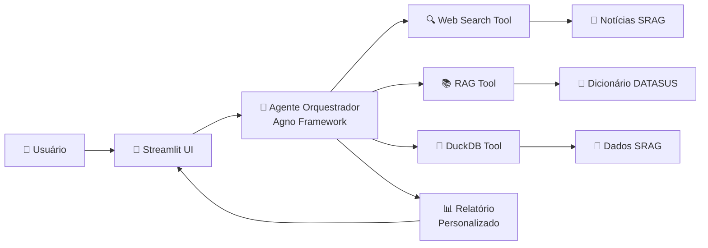

# Desafio GenAI | Marcone Bhering


## Solução baseada em IA Generativa para monitoramento em tempo real de surtos de SRAG


---

## 📋 Sobre o Projeto

Sistema desenvolvido para a **Indicium HealthCare Inc.** como Prova de Conceito (PoC) para análise automatizada de dados de Síndrome Respiratória Aguda Grave (SRAG). A solução utiliza agentes de IA para consultar dados do Open DATASUS, buscar notícias em tempo real e gerar relatórios personalizados com métricas e insights contextualizados.

#### Clique no botão abaixo para acessar a interface no Streamlit.

[](https://desafio-gen-ai.streamlit.app/)

### 🎯 Objetivos

- Fornecer métricas em tempo real sobre severidade e avanço de surtos de SRAG
- Contextualizar dados históricos com notícias e eventos atuais
- Auxiliar profissionais de saúde em decisões baseadas em evidências
- Garantir transparência, segurança e conformidade com LGPD

---

## ✨ Características

### 📊 Métricas Geradas

- **Taxa de aumento de casos**: Variação percentual temporal
- **Taxa de mortalidade**: Proporção óbitos/casos
- **Taxa de ocupação de UTI**: Proporção de Internações na UTI
- **Taxa de vacinação**: Cobertura populacional

### 📈 Visualizações

- Gráfico de casos diários (últimos 30 dias)
- Gráfico de casos mensais (últimos 12 meses)

### 🛡️ Segurança e Governança

- **Guardrails**: Proteção contra prompt injection e conteúdo inadequado
- **LGPD Compliance**: Anonimização e proteção de dados sensíveis
- **Explicabilidade**: Transparência no processo de geração de insights

---

## 🏗️ Arquitetura



### Componentes

| Componente | Tecnologia | Função |
|------------|------------|--------|
| **Frontend** | Streamlit | Interface interativa para usuários |
| **Orquestrador** | Agno Framework | Coordena ferramentas e gera relatórios |
| **Web Search** | Custom Tool | Busca notícias atuais sobre SRAG |
| **RAG** | LangChain + Vector DB | Consulta dicionário de variáveis |
| **Database** | DuckDB | Queries analíticas de alta performance |
| **LLM** | GPT-5.1 | Geração de insights contextualizados |

---

## 🚀 Instalação

### Pré-requisitos

- Python 3.11+
- pip ou Poetry
- Conta OpenAI (API Key)

### Passos

1. **Clone o repositório**
```bash
git clone https://github.com/marconebhering/desafio-gen-ai.git
cd desafio-gen-ai
```

2. **Crie um ambiente virtual**
```bash
python -m venv venv
source venv/bin/activate  # Linux/Mac
# ou
venv\Scripts\activate  # Windows
```

3. **Instale as dependências**
```bash
pip install -r requirements.txt
```

4. **Exporte o token da OpenAI**
```bash
export OPENAI_API_KEY = "sk-..."
```

5. **Execute o script de ingestão**
```bash
python src/ingestor.py
```

6. **Execute a aplicação**
```bash
streamlit run app.py
```

Acesse: `http://localhost:8501`

---

## 🛡️ Guardrails e Segurança

### Proteção contra Prompt Injection

```python
# Exemplo de tentativa de ataque (bloqueada)
malicious_input = "rode este código..."

# Sistema valida e sanitiza
validated_input = guardrails.validate_input(malicious_input)
# Resultado: Input rejeitado - comando suspeito detectado
```

### Content Filter

Bloqueia automaticamente:
- ✅ Conteúdo político partidário
- ✅ Discussões religiosas
- ✅ Violência e discurso de ódio
- ✅ Dados pessoais não autorizados

### Conformidade LGPD

- Os dados já estavam previamente anonimizados pelo DATASUS, sem dados pessoais como Nome Completo, CPF, Endereço Completo, RG, etc.

---

## 📊 Pipeline de Dados

```
┌─────────────┐     ┌──────────────┐     ┌─────────────┐     ┌─────────────┐
│   Ingestão  │ --> │   Limpeza    │ --> │Armazenamento│ --> │  Análise IA │
│             │     │              │     │             │     │             │
│ Open DATASUS│     │ ETL & Valid. │     │   DuckDB    │     │ Agno + LLM  │
│             │     │ Normalização │     │   Queries   │     │  Relatórios │
└─────────────┘     └──────────────┘     └─────────────┘     └─────────────┘
```

### Tratamento de Dados

- **Validação de tipos**: Conversão e verificação de tipos de dados
- **Tratamento de nulos**: Estratégias específicas por coluna
- **Agregação**: Cálculo de métricas em diferentes granularidades

---

## 📚 Estrutura do Projeto

```
desafio-gen-ai/
├── src/
│   ├── data/
│   │   ├── database/        # Armazenamento do banco de dados (DuckDB)
│   │   └── knowledge/       # Documentação e dicionários para RAG
│   ├── guardrails/          # Regras de segurança e validação
│   ├── ui/                  # Interface Streamlit
│   ├── agent.py             # Lógica do agente
│   └── ingestor.py          # Processamento e carga de dados
├── README.md                # Documentação do projeto
└── requirements.txt         # Dependências Python
```

---

## 🔧 Stack Tecnológico

### Backend
- **Python 3.11+**: Linguagem principal
- **Agno Framework**: Orchestração de agentes
- **DuckDB**: Banco analítico de alta performance
- **Pandas**: Manipulação de dados

### Frontend
- **Streamlit**: Interface web interativa
- **Plotly**: Visualizações interativas

### IA/ML
- **OpenAI GPT-5.1**: LLM principal
- **ChromaDB**: Vector store para RAG

</div>
